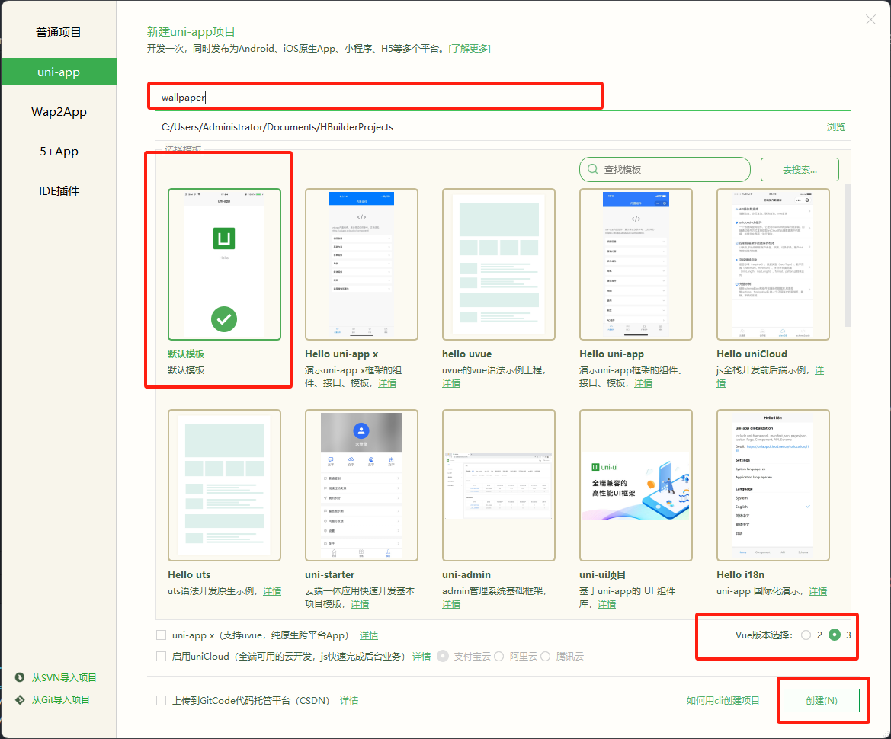
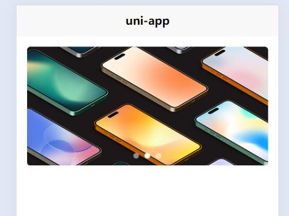
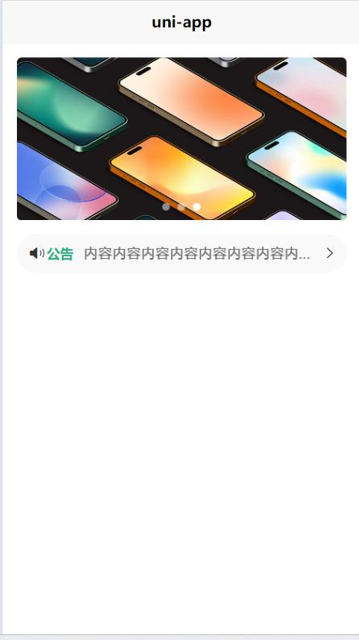
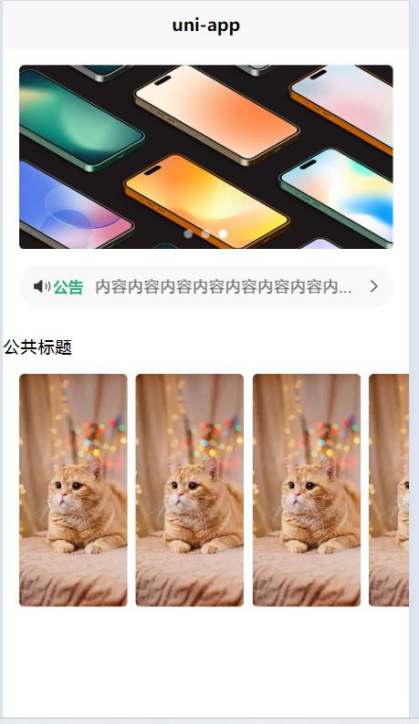
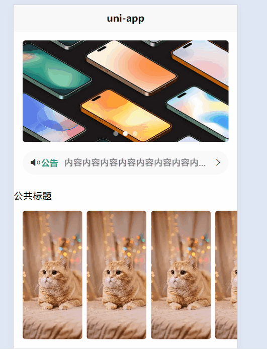
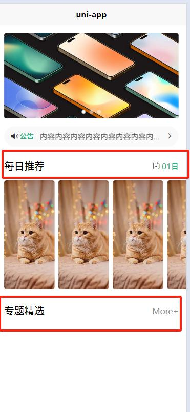
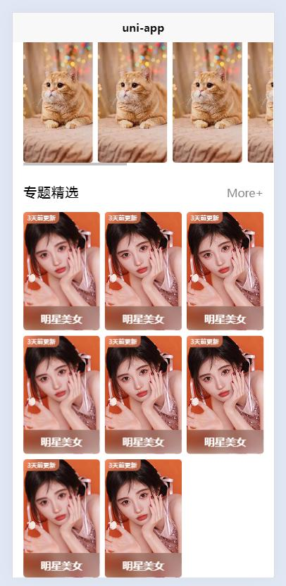
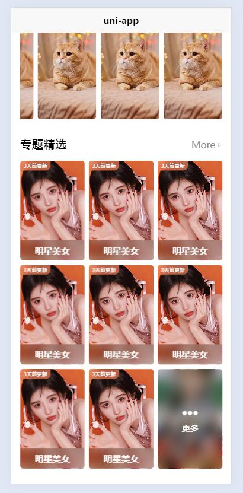

# uniapp-咸虾米壁纸（小程序）
## 1.创建项目

### 1.引入静态资源
> 新建common 目录，把静态资源放在common 下（只有导入才会打包），因为放static下的所有资源默认都会打包进去（不管你引没有引入）

uniapp参考说明：

https://uniapp.dcloud.net.cn/tutorial/project.html#static

### 2.static目录

- 为什么需要static这样的目录？

uni-app编译器根据pages.json扫描需要编译的页面，并根据页面引入的js、css合并打包文件。
对于本地的图片、字体、视频、文件等资源，如果可以直接识别，那么也会把这些资源文件打包进去，但如果这些资源以变量的方式引用， 比如：`<image :src="url"></image>`，甚至可能有更复杂的函数计算，此时编译器无法分析。

那么有了static目录，编译器就会把这个目录整体复制到最终编译包内。这样只要运行时确实能获取到这个图片，就可以显示。

当然这也带来一个注意事项，如果static里有一些没有使用的废文件，也会被打包到编译包里，造成体积变大。

另外注意，static目录支持特殊的平台子目录，比如web、app、mp-weixin等，这些目录存放专有平台的文件，这些平台的文件在打包其他平台时不会被包含。详见[条件编译](https://uniapp.dcloud.net.cn/tutorial/platform.html#static-目录的条件编译)

非 `static` 目录下的文件（vue组件、js、css 等）只有被引用时，才会被打包编译。

`css`、`less/scss` 等资源不要放在 `static` 目录下，建议这些公用的资源放在自建的 `common` 目录下。

- static目录和App原生资源目录有关系吗？

uni-app支持App原生资源目录nativeResources，下面有assets、res等目录，[详见](https://uniapp.dcloud.net.cn/tutorial/app-nativeresource-android.html#nativeresources)。但和static目录没有关系。

static目录下的文件，在app第一次启动时，解压到了app的外部存储目录（external-path）。（uni-app x 从3.99+不再解压）

所以注意控制static目录的大小，太大的static目录和太多文件，会造成App安装后第一次启动变慢。

### 3.在App.vue 引入公共样式
```vue
<style lang="scss">
	/*每个页面公共css */
	@import "common/style/common-style.scss"
</style>
```


## 2.index 页面(轮播图)

### 2.1.banner海报swiper轮播器

```vue
<template>
	<view class="homeLayout">
		<view class="banner">
			<!-- circular 衔接滚动  
			indicator-dots 面板指示点 
			indicator-color 指示点颜色
			indicator-active-color 激活的指示点颜色
			autoplay 自动切换
			-->
			<swiper circular indicator-dots indicator-color="rgba(255,255,255,0.5)" indicator-active-color="#fff"
				autoplay :interval="3000" :duration="1000">
				<swiper-item v-for="item in 3">
					<image src="../../common/images/banner1.jpg" mode=""></image>
				</swiper-item>

			</swiper>
		</view>
	</view>
</template>

<script setup>

</script>

<style lang="scss" scoped>
	.homeLayout {
		.banner {
			width: 750rpx;
			padding: 30rpx 0;

			swiper {
				width: 750rpx;
				height: 340rpx;

				&-item {
					width: 100%;
					height: 100%;
					padding: 0 30rpx;

					image {
						width: 100%;
						height: 100%;
						border-radius: 10rpx;
					}
				}
			}
		}
	}
</style>
```




### 2.2.使用swiper的纵向轮播做公告区域
```vue
<!-- 公告（垂直的轮播） -->
<template>
<view class="notice">
	<view class="left">
		<uni-icons type="sound-filled" size="20"></uni-icons>
		<text class="text">公告</text>
	</view>
	<view class="center">
		<swiper vertical autoplay interval="1500" duration="300" circular>
			<swiper-item v-for="item in 3">
				内容内容内容内容内容内容内容内容内容内容内容
			</swiper-item>
		</swiper>
	</view>
	<view class="right">
		<uni-icons type="right" size="16" color="#333"></uni-icons>
	</view>
</view>
</template>

<style lang="scss" scoped>
.notice {
	width: 690rpx;
	height: 80rpx;
	line-height: 80rpx;
	background: #f9f9f9;
	margin: 0 auto; // 水平居中
	border-radius: 80rpx;
	display: flex;

	.left {
		width: 140rpx;
		display: flex;
		justify-content: center;
		align-items: center;

		.text {
			color: #28b389;
			font-weight: 600;
			font-size: 28rpx;
		}
	}

	.center {
		//共690rpx，左140rpx，右70rpx
		// flex：1 表示占据剩余的空间 
		flex: 1;

		swiper {
			height: 100%;

			&-item {
				height: 100%;
				font-size: 30rpx;
				color: #666;
				// 文字过长自动显示三个点点点（只需加三个属性）
				overflow: hidden; //溢出隐藏
				white-space: nowrap; //文字不换行
				text-overflow: ellipsis; // 显示省略号...
			}
		}
	}

	.right {
		width: 70rpx;
		display: flex;
		justify-content: center;
		align-items: center;
	}
}
</style>
```


### 2.3.每日推荐滑动scroll-view布局
```vue
<template>
<!-- 展示区域 -->
<view class="select">
	<common-title></common-title>
	<!-- scroll-x 可在x轴滑动   -->
	<view class="content">
		<scroll-view scroll-x>
			<view class="box" v-for="item in 8">
				<image src="../../common/images/preview_small.webp" mode="aspectFill"></image>
			</view>
		</scroll-view>
	</view>
</view>
</template>

<style lang="scss" scoped>
.select {
	padding-top: 50rpx;

	.content {
		width: 720rpx;
		margin-left: 30rpx;
		margin-top: 30rpx;
		scroll-view {
			white-space: nowrap; //不换行，让元素一行上面（搭配 display: inline-block;）
			.box {
				width: 200rpx;
				height: 430rpx;
				display: inline-block; //将块元素改为行内块
				margin-right: 15rpx;
				image {
					width: 100%;
					height: 100%;
					border-radius: 10rpx;
				}
			}
			.box:last-child {
				// 让box盒子里面的最后一个元素margin-right为30rpx
				margin-right: 30rpx;
			}
		}
	}
}

</style>
```



### 2.4.组件具名插槽定义公共标题模块
> uniapp中 只要遵循 components/组件名/组件名.vue 在其他页面无需导入，可以直接使用
组件路径： `components/common-title/common-title.vue`
```vue
<template>
	<view class="common-title">
		<view class="name">
			<slot name="name"></slot>
		</view>
		<view class="custom">
			<slot name="custom"></slot>
		</view>
	</view>
</template>

<script setup>

</script>

<style lang="scss" scoped>
	.common-title {
		display: flex;
		justify-content: space-between;
		align-items: center;
		padding: 0 30rpx;

		.name {
			font-size: 40rpx
		}
	}
</style>
```
使用`common-title`组件
```vue
<template>

<!-- 展示区域 -->
<view class="select">
	<common-title>
		<template #name>每日推荐</template>
		<template #custom>
			<view class="date">
				<uni-icons type="calendar" size="18"></uni-icons>
				<view class="text">
					<uni-dateformat :date="Date.now()" format="dd日"></uni-dateformat>
				</view>
			</view>
		</template>
	</common-title>
	

</view>

<!-- 专题精选 -->
<view class="theme">
	<common-title>
		<template #name>专题精选</template>
		<template #custom>
			<navigator url="/pages/classify/classify" open-type="reLaunch" class="more">More+</navigator>
		</template>
	</common-title>

	<view class="content">

	</view>

</view>
</template>

<style lang="scss" scoped>
.select {
	.date {
		color: #28b389;
		display: flex;
		align-items: center;

		.text {
			margin-left: 5rpx;
		}
	}
}

.theme {
	padding-top: 50rpx;

	.more {
		font-size: 32rpx;
		color: #888;
	}
}
</style>

```


### 2.5.细节拉满 磨砂背景定位布局做专题组件
```vue
<template>
<!-- 专题精选 -->
<view class="theme">

	<view class="content">
		<theme-item v-for="item in 8"></theme-item>
	</view>
</view>
</template>

<style lang="scss" scoped>
.theme {
	
	.content {
		margin-top: 30rpx;
		padding: 0 30rpx;
		display: grid; // 网格布局
		gap: 15rpx; // 间隙15rpx
		grid-template-columns: repeat(3, 1fr); // 重复三列，平均分配
	}
}
</style>
```

组件路径： `components/theme-item/theme-item.vue`

```vue
<template>
	<view class="themeItem">
		<navigator url="" class="box">
			<image class="pic" src="../../common/images/classify1.jpg" mode="aspectFill"></image>
			<view class="mask">明星美女</view>
			<view class="tab">3天前更新</view>
		</navigator>
	</view>
</template>

<script setup>

</script>

<style lang="scss" scoped>
	.themeItem {
		.box {
			height: 340rpx;
			border-radius: 10rpx;
			overflow: hidden;
			position: relative;

			.pic {
				width: 100%;
				height: 100%;
			}

			.mask {
				width: 100%;
				height: 70rpx;
				position: absolute;
				bottom: 0;
				left: 0;
				background: rgba(0, 0, 0, 0.2);
				display: flex;
				justify-content: center;
				align-items: center;
				font-size: 30rpx;
				font-weight: 600;
				color: #fff;
				backdrop-filter: blur(20rpx); // 背景模糊20rpx

			}

			.tab {
				position: absolute;
				left: 0;
				top: 0;
				background: rgba(250, 129, 90, 0.7);
				backdrop-filter: blur(20rpx);
				padding: 6rpx 14rpx;
				color: #fff;
				border-radius: 0 0 20rpx 0;
				// 因为字体最小只能是 12px，如果需要比12p小，
				// 就需要用到transform进行缩放，因为缩放默认是在中心
				// 所以修改缩放位置是左上角
				font-size: 22rpx;
				transform: scale(0.8);
				transform-origin: left top;
			}
		}
	}
</style>
```


### 2.6.同一组件Props传递不同属性值展示不同效果
`pages/index/index.vue`
```vue
<view class="content">
	<theme-item v-for="item in 8"></theme-item>
	<theme-item :isMore="true"></theme-item>
</view>
```

`components/theme-item/theme-item.vue`
```vue
<template>
	<view class="themeItem">
		<navigator url="" class="box" v-if="!isMore">
			<image class="pic" src="../../common/images/classify1.jpg" mode="aspectFill"></image>
			<view class="mask">明星美女</view>
			<view class="tab">3天前更新</view>
		</navigator>
		<navigator url="" class="box more" v-if="isMore">
			<image class="pic" src="../../common/images/more.jpg" mode="aspectFill"></image>
			<view class="mask">
				<uni-icons type="more-filled" size="34" color="#fff"></uni-icons>
				<view class="text">更多</view>
			</view>
		</navigator>
	</view>
</template>

<script setup>
	defineProps({
		isMore: {
			type: Boolean,
			default: false
		}
	})
</script>

<style lang="scss" scoped>
	.themeItem {
		.box {
			height: 340rpx;
			border-radius: 10rpx;
			overflow: hidden;
			position: relative;

			.pic {
				width: 100%;
				height: 100%;
			}

			.mask {
				width: 100%;
				height: 70rpx;
				position: absolute;
				bottom: 0;
				left: 0;
				background: rgba(0, 0, 0, 0.2);
				display: flex;
				justify-content: center;
				align-items: center;
				font-size: 30rpx;
				font-weight: 600;
				color: #fff;
				backdrop-filter: blur(20rpx); // 背景模糊20rpx

			}

			.tab {
				position: absolute;
				left: 0;
				top: 0;
				background: rgba(250, 129, 90, 0.7);
				backdrop-filter: blur(20rpx);
				padding: 6rpx 14rpx;
				color: #fff;
				border-radius: 0 0 20rpx 0;
				// 因为字体最小只能是 12px，如果需要比12p小，
				// 就需要用到transform进行缩放，因为缩放默认是在中心
				// 所以修改缩放位置是左上角
				font-size: 22rpx;
				transform: scale(0.8);
				transform-origin: left top;
			}
		}

		.box.more {
			.mask {
				width: 100%;
				height: 100%;
				flex-direction: column;
			}

			.text {
				font-size: 28rpx;
			}
		}
	}
</style>
```
